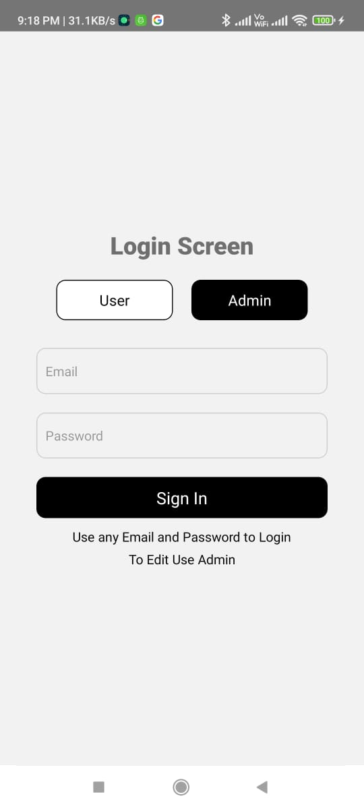
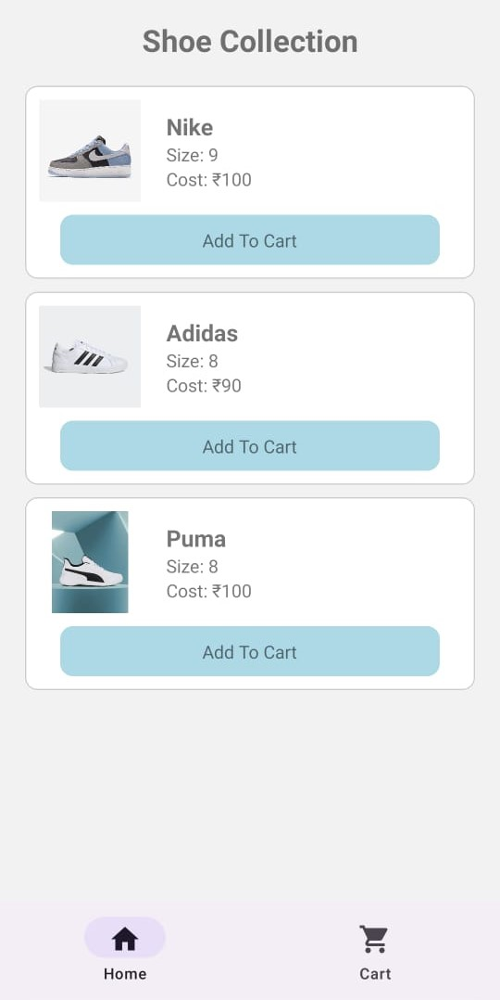
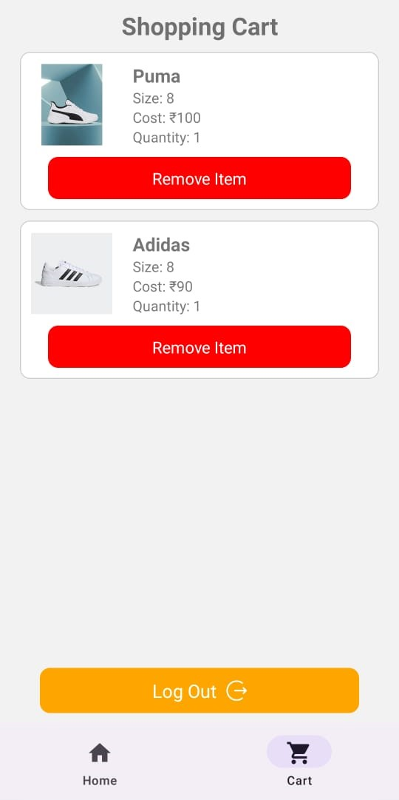
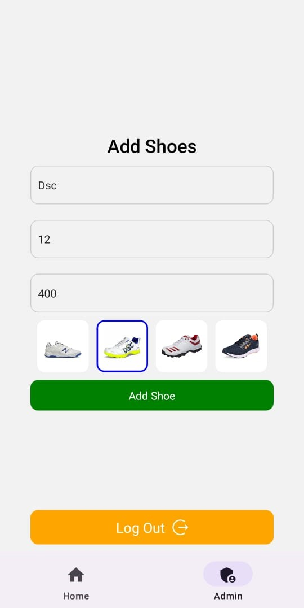

# Shoe Store App

Welcome to the Shoe Store App, a simple mobile application for shopping for shoes. This app allows both users and administrators to access different features based on their roles.

## Features

### User Features

- **Login**: Users can log in using their credentials.
  
- **Home**: Users can browse and search for shoes in the app's catalog.
  
- **Cart**: Users can view and manage the items in their shopping cart.
  

### Admin Features

- **Login**: Admins can log in using their credentials.
- **Home**: Admins can access the app's administrative dashboard for managing products and users.
  

## Installation

1. Clone the repository: `git clone https://github.com/yourusername/shoe-store-app.git`
2. Navigate to the project directory: `cd shoe-store-app`
3. Install dependencies: `npm install` or `yarn install`

## Usage

### User Login

- Launch the app.
- On the login screen, press the "User" button.
- Enter your username and password.
- Press the "Login" button.

### Admin Login

- Launch the app.
- On the login screen, press the "Admin" button.
- Enter your admin credentials.
- Press the "Login" button.

### Navigation

#### User

- After logging in as a user, you will have access to the following tabs:
  - **Home**: Browse and search for shoes.
  - **Cart**: View and manage items in your shopping cart.

#### Admin

- After logging in as an admin, you will have access to the following tabs:
  - **Home**: Access the administrative dashboard for managing products and users.

## Contributing

Contributions are welcome! If you'd like to contribute to this project, please follow these steps:

1. Fork the repository on GitHub.
2. Clone your forked repository locally.
3. Create a new branch for your feature or bug fix: `git checkout -b feature-name`
4. Make your changes and commit them: `git commit -m 'Add feature XYZ'`
5. Push your changes to your fork on GitHub: `git push origin feature-name`
6. Create a pull request on the original repository.

## License

This project is licensed under the MIT License. See the [LICENSE](LICENSE) file for details.
